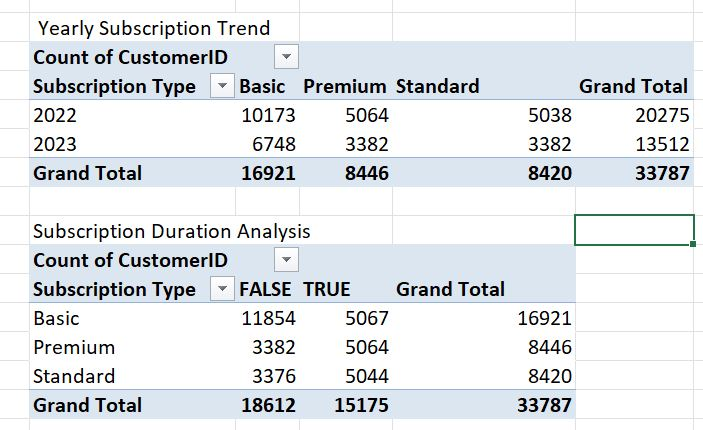
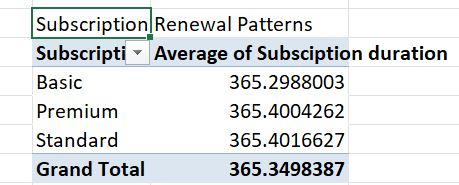
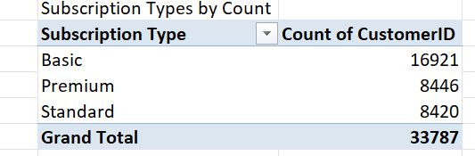
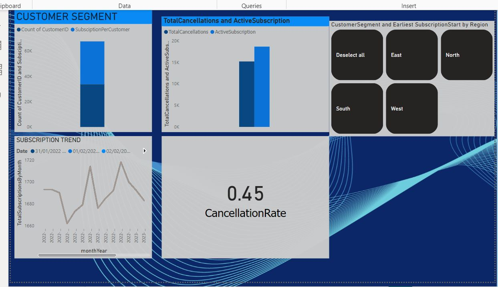

### LITA-CAPSTONE-PROJECT-2

### Project Overview: 
### Customer Segmentation for a Subscription Service

### Project Description

This project involves a comprehensive analysis of customer data for a subscription-based service. The main goal is to understand and categorize customer behavior by identifying different customer segments based on subscription patterns, engagement levels, and key trends in cancellations and renewals. By segmenting the customer base, we aim to provide actionable insights that can help the company enhance customer retention, target personalized marketing efforts, and ultimately increase overall customer satisfaction and revenue.

### Goals

- Identify Customer Segments: Use customer data to group subscribers into distinct segments based on behavior, subscription type, usage frequency, and engagement.
- Analyze Subscription Trends: Track subscription types and their popularity over time to understand preferences and trends in customer choices.
- Understand Cancellation and Renewal Patterns: Identify factors that contribute to cancellations and renewals, with the aim of recognizing common pain points and opportunities for improved retention.


### Objectives

- Data Collection and Cleaning: Gather and preprocess customer data, ensuring accuracy and consistency for effective analysis.
- Segmentation Analysis: Use clustering techniques (e.g., K-means, hierarchical clustering) to segment customers based on key attributes such as frequency of use, subscription type, and spending behavior.
- Churn Analysis: Investigate trends and factors associated with customer churn, including time since initial subscription, subscription type, and engagement levels.
-Renewal Patterns: Analyze renewal trends by customer segment, subscription type, and usage frequency to identify which segments have the highest likelihood of renewal.


### Tools Used

**Excel**: For initial data cleaning, exploratory data analysis, and summarizing insights.

**SQL**: To query and manipulate customer data, identifying segments based on conditions like subscription type, frequency, and churn status.

**Power BI**: To create dashboards and visualizations that clearly display customer segments, churn rates, and other trends.


### Expected Outcomes

- A clear set of customer segments with descriptions of each segment's characteristics and behavior.
- Insights into key factors driving customer cancellations and renewals.
- Visualizations that highlight subscription trends, renewal patterns, and other important customer behaviors, aiding decision-making for targeted marketing and retention strategies.

### Project Structure

- README.md:Contains the main project documentation, including the project overview,goals, methodology, and results
- Data/: Folder containing data files.
  * Raw_data.csv: The original dataset with customer subscription data
  * Processed_data.csv: The cleaned dataset used for analysis
   
- Scripts/:Contains code script to clean and preprocess the raw data.

- Images/: Folder for visualizations generated in the project
  * customer_segments.png: Visual representation of customer segments.
  * churn_trends.png: Graph showing trends in subscription churn
 
- reports/: Final report or presentation files summarizing findings.
 *summary_report.pdf: PDF report with key insights and recommendations.

  ## Data Description
  The dataset contains subscription service data with the following main attributes:
  - CustomerID: Unique identifier for each customer
  - CustomerName: For more identification with the customer ID
  - Region: Customer Region
  - SubscriptionType: Type of subscription
  - SubscriptionStart: Subscription start date
  - SubscriptionEnd: Subscription end date
  - Canceled: To show active and canceled customer
  - Revenue: Revenue generated by the customer
 
  ### Analysis Methodology
  
  **Data Cleaning**: Removed duplicates
  - Handled missing values and normalized data.
 
    
 I analyze customer data using pivot tables to find subscription patterns.

 

 To calculate the average subscription duration 

 
 
 identify the most popular subscription types.

 

 Then i wrote queries to extract key insights based on the following analysis


  - retrieve the total number of customers from each region

```
| SQL Query | Screenshot |
|-----------|------------|
|select * from CustomerData
 select Region,                                            
 COUNT(CustomerID) AS TotalCustomers
 FROM
 CustomerData
 Group by Region; |  |

   
                                                    ```sql
                                                    select * from CustomerData
                                                    select Region,                                            
                                                    COUNT(CustomerID) AS TotalCustomers
                                                    FROM
                                                    CustomerData
                                                    Group by Region; 


* find the most popular subscription type by the number of customers


select SubscriptionType,
count(CustomerID) AS CustomerCount
from CustomerData
Group by SubscriptionType
order by CustomerCount Desc

* find customers who canceled their subscription within 6 months


select CustomerID,SubscriptionStart,SubscriptionEnd
from
CustomerData
where SubscriptionEnd IS NOT NULL
AND DATEDIFF(MONTH,SubscriptionStart,SubscriptionEnd)<=6;

* calculate the average subscription duration for all customers


select AVG(DATEDIFF(DAY,SubscriptionStart,SubscriptionEnd)) AS
AvgSubscriptionDuration
from
CustomerData
where SubscriptionEnd IS NOT NULL;-----IN DAYS

select AVG(DATEDIFF(MONTH,SubscriptionStart,SubscriptionEnd)) AS
AvgSubscriptionDuration
from
CustomerData
where SubscriptionEnd IS NOT NULL;--- IN MONTH

select AVG(DATEDIFF(MONTH,SubscriptionStart,SubscriptionEnd)) AS
AvgSubscriptionDuration
from
CustomerData
where SubscriptionEnd IS NULL;

SELECT AVG(DATEDIFF(DAY,SubscriptionStart,
coalesce(SubscriptionEnd,GETDATE())))
AS AvgSubscriptionDuration
from
CustomerData;-----For Active Subscription.

* find customers with subscriptions longer than 12 months-------


select CustomerID,SubscriptionStart,SubscriptionEnd
from
CustomerData
where DATEDIFF(MONTH,SubscriptionStart,
coalesce(SubscriptionEnd,GETDATE()))>12; 

* calculate total revenue by subscription type


SELECT SubscriptionType,
sum(Revenue) AS TotalRevenue
from CustomerData
Group by
SubscriptionType;

* find the top 3 regions by subscription cancellations


select TOP 3
Region,
COUNT(*) AS CancellationCount
from
CustomerData
where
Canceled= 'TRUE'
GROUP BY REGION
ORDER BY CancellationCount DESC

* find the total number of active and canceled subscriptions


SELECT
SUM(CASE WHEN canceled='TRUE'
THEN 1 ELSE 0 END) AS TotalCanceled,
SUM(CASE WHEN canceled = 'FALSE'
THEN 1 ELSE 0 END) AS TotalActive
from
CustomerData;
```


 I used Power BI to build a Power BI dashboard that visualizes
* key customer segments
* cancellations, and subscription trends.
* I included slicers for interactive analysis.




### Key Insights

1. Customer Segmentation Patterns:

- Identified several key customer segments, such as high-frequency users, budget-conscious users, and loyal long-term subscribers.
- These segments showed distinct behaviors; for example, high-frequency users were more likely to renew subscriptions,  
  while budget-conscious users often canceled within a short period.


2. Subscription Trends:

- The renewal rate was highest among customers who have used the service wihin a year, indicating increased loyalty over time.
- Seasonal trends showed an increase in subscriptions during the holiday season, while cancellations spiked in the months following.


3. Churn Analysis:

- A significant portion of cancellations occurred among customers within the first three months of subscription, suggesting the need for improved onboarding and engagement strategies.
- Churn was more common in Basic subscription plans, indicating potential dissatisfaction or unmet expectations in these segments.


4. Customer Retention:

- High retention was observed among customers engaging with basic subscription plan in year 2022 but dropped in the year 2023
- Loyalty programs and engagement tactics (like personalized emails and renewal discounts) showed a positive effect on customer retention rates.


##Future Recommendations

1. Enhanced Onboarding Experience:

- Develop a more comprehensive onboarding process for new subscribers, with tutorials, welcome emails, and tailored recommendations to help users derive value quickly and reduce early cancellations.
2. Targeted Retention Strategies:

- Focus on targeted retention efforts for high-churn segments (like budget-conscious users). Offer special incentives, such as discounts for long-term subscriptions or flexible payment options, to retain these customers.


3. Seasonal Marketing Campaigns:

- Run seasonal marketing campaigns to capitalize on holiday sign-ups, with promotional offers for new subscribers and re-engagement offers for past customers who have canceled.

4. Expand Premium Offerings:

- Based on the high retention rate for premium features, consider expanding premium offerings or creating exclusive add-ons that can be bundled with subscription plans to boost satisfaction and increase renewal rates.


5. Improved Data Collection for Customer Feedback:

- Collect and analyze feedback from canceled subscriptions to better understand reasons for churn. Use surveys or exit interviews to gather insights, which can inform product improvements and tailored re-engagement efforts.


6. Experiment with Pricing and Plans:

- Consider introducing more flexible or tiered pricing plans to cater to different customer segments, like budget-conscious users. Test different price points and plan options to optimize for retention and satisfaction.


 
  
  
  

